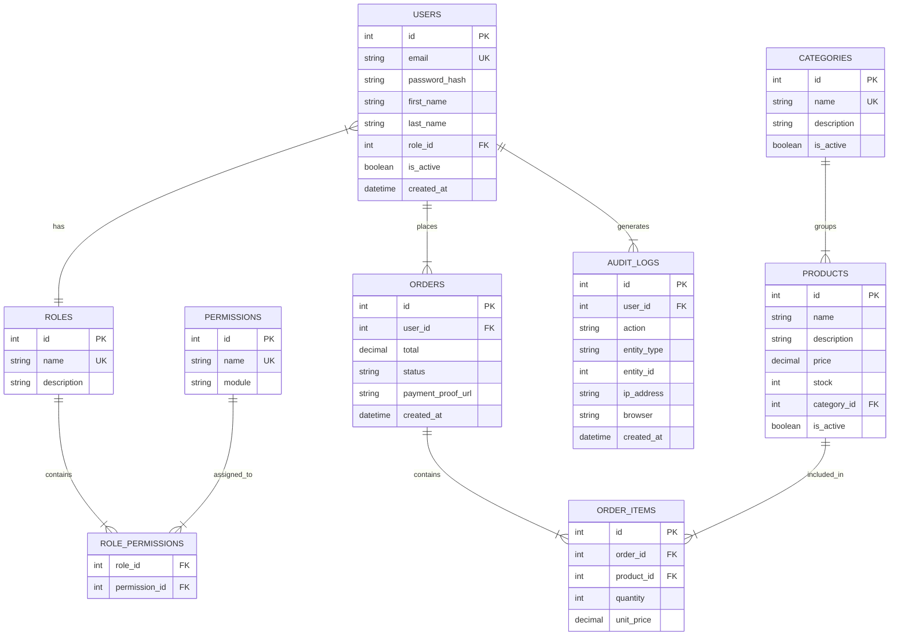

# SPEC 02: Database

## 1. Consideraciones Generales
La base de datos será **MySQL** administrada localmente mediante **XAMPP**.
La gestión de esquemas se realizará a través de migraciones de **Alembic** y el ORM **SQLAlchemy**.

## 2. Diagrama Entidad-Relación (DER) / Relacional

## 3. Auditoría y Trazabilidad
Se implementará una tabla global `AUDIT_LOGS` que registrará todas las acciones de modificación (CREATE, UPDATE, DELETE) en tablas críticas, guardando la IP, el agente de usuario, el ID del usuario y el registro afectado.

## 4. Índices
Se crearán índices explícitos en:
- `users.email`
- `orders.user_id`
- `orders.status`
- `products.category_id`
- `audit_logs.created_at`
- `audit_logs.user_id`

## 5. Triggers
(Opcional, preferible manejar mediante lógica de la aplicación en el nivel de `Services` o eventos de SQLAlchemy, a menos que el rendimiento exija consistencia dura en el motor para evitar desajustes de inventario en Kardex).

## 6. Soporte Multi-Sucursal (Futuro)
El diseño contempla a futuro la adición de `branch_id` en `USERS`, `ORDERS` y un inventario separado para escalar a un modelo multi-sucursal o multitenant.
